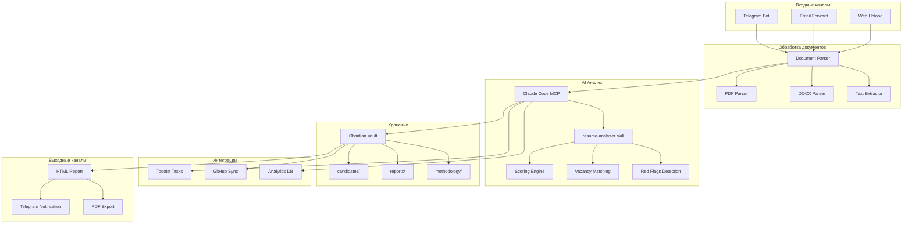
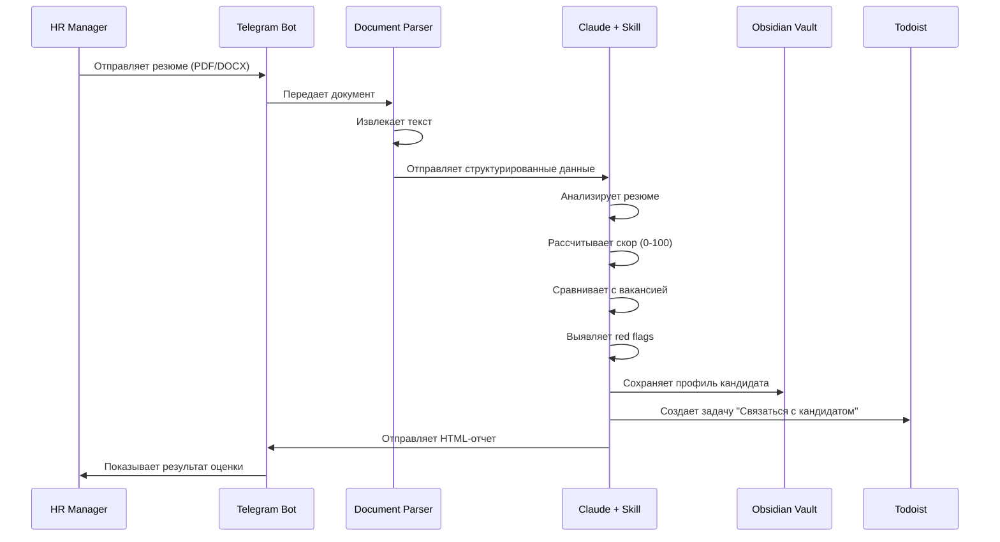

# Архитектура HR-Шлюза (HR Gateway)

**Дата:** 2026-02-09  
**Версия:** 1.0 (MVP)

---

## Общая архитектура системы



---

## Поток обработки резюме



---

## Структура данных кандидата

```yaml
---
type: candidate
name: Иван Петров
email: ivan.petrov@example.com
phone: +375291234567
vacancy: Senior Python Developer
date_received: 2026-02-09
status: new
score: 85
recommendation: interview
---

# Иван Петров

## Контактная информация
- Email: ivan.petrov@example.com
- Телефон: +375291234567
- LinkedIn: linkedin.com/in/ivanpetrov
- GitHub: github.com/ivanpetrov

## Оценка (Score: 85/100)

### Опыт работы (30/35)
- 5 лет в Python разработке ✅
- Опыт с Django, FastAPI ✅
- Работа в продуктовых компаниях ✅
- Нет опыт лидерства команды ⚠️

### Технические навыки (28/30)
- Python (advanced) ✅
- PostgreSQL, Redis ✅
- Docker, Kubernetes ✅
- AWS (базовый уровень) ⚠️

### Образование (10/10)
- БГУИР, Информатика и вычислительная техника ✅
- Курсы по ML/AI ✅

### Культурный fit (12/15)
- Ценности совпадают ✅
- Мотивация к росту ✅
- Коммуникативные навыки (требует проверки) ⚠️

### Дополнительно (5/10)
- Английский B2 ✅
- Открытый код (GitHub активность) ✅
- Нет публикаций/докладов ⚠️

## Red Flags
- ⚠️ Частая смена работы (3 компании за 2 года)
- ⚠️ Пробелы в резюме (3 месяца в 2024)

## Сильные стороны
- Глубокие знания Python и веб-фреймворков
- Опыт работы с высоконагруженными системами
- Активный участник open-source сообщества

## Слабые стороны
- Отсутствие опыта управления командой
- Базовый уровень английского для senior позиции
- Нет опыта работы в финтехе (наша специфика)

## Рекомендация
**Пригласить на техническое интервью**

Кандидат соответствует 85% требований. Сильные технические навыки компенсируют отсутствие лидерского опыта. Рекомендуется проверить:
1. Причины частой смены работы
2. Уровень английского на практике
3. Готовность к обучению специфике финтеха

## Следующие шаги
- [ ] Связаться с кандидатом (до 2026-02-12)
- [ ] Назначить техническое интервью
- [ ] Подготовить тестовое задание

## История взаимодействия
- 2026-02-09: Резюме получено и обработано
- 2026-02-09: Создана задача в Todoist (ID: 8501234567)

## Связанные заметки
- [[vacancies/senior-python-developer]]
- [[methodology/scoring-criteria]]
- [[reports/2026-02-09-batch-analysis]]
```

---

## Модули системы

### 1. Document Parser

**Файл:** `src/d_brain/services/document_parser.py`

**Функции:**
- Извлечение текста из PDF (pdfplumber)
- Извлечение текста из DOCX (python-docx)
- Определение структуры резюме
- Извлечение контактов (regex)

**Пример использования:**
```python
from d_brain.services.document_parser import DocumentParser

parser = DocumentParser()
resume_data = parser.parse_file("resume.pdf")

# Результат:
{
    "raw_text": "...",
    "name": "Иван Петров",
    "email": "ivan.petrov@example.com",
    "phone": "+375291234567",
    "sections": {
        "experience": "...",
        "education": "...",
        "skills": "..."
    }
}
```

### 2. Resume Analyzer Skill

**Файл:** `vault/.claude/skills/resume-analyzer/SKILL.md`

**Функции:**
- Структурированный анализ резюме
- Расчет скора по критериям
- Matching с вакансией
- Выявление red flags
- Генерация рекомендаций

**Критерии оценки:**
1. **Опыт работы (35%)** — релевантность, длительность, компании
2. **Технические навыки (30%)** — соответствие требованиям
3. **Образование (10%)** — профильное образование, курсы
4. **Культурный fit (15%)** — ценности, мотивация
5. **Дополнительно (10%)** — языки, публикации, open-source

### 3. Scoring Engine

**Алгоритм расчета:**
```python
def calculate_score(resume: dict, vacancy: dict) -> int:
    """
    Расчет итогового скора кандидата
    
    Returns:
        int: Скор от 0 до 100
    """
    weights = {
        "experience": 0.35,
        "skills": 0.30,
        "education": 0.10,
        "culture_fit": 0.15,
        "additional": 0.10
    }
    
    scores = {
        "experience": evaluate_experience(resume, vacancy),
        "skills": evaluate_skills(resume, vacancy),
        "education": evaluate_education(resume, vacancy),
        "culture_fit": evaluate_culture_fit(resume, vacancy),
        "additional": evaluate_additional(resume, vacancy)
    }
    
    total_score = sum(
        scores[key] * weights[key] 
        for key in weights
    )
    
    return int(total_score)
```

### 4. Red Flags Detection

**Автоматическое выявление:**
- ⚠️ Частая смена работы (>2 компаний в год)
- ⚠️ Пробелы в резюме (>3 месяцев)
- ⚠️ Несоответствие опыта и позиции
- ⚠️ Отсутствие контактов
- ⚠️ Грамматические ошибки (>5 на страницу)
- ⚠️ Завышенные требования по зарплате
- ⚠️ Нерелевантный опыт

### 5. Vacancy Matching

**Сравнение с требованиями вакансии:**
```python
def match_with_vacancy(resume: dict, vacancy: dict) -> dict:
    """
    Сравнение резюме с вакансией
    
    Returns:
        dict: {
            "match_score": 85,
            "matched_skills": ["Python", "Django", "PostgreSQL"],
            "missing_skills": ["Kubernetes", "AWS"],
            "overqualified": ["ML/AI experience"]
        }
    """
```

---

## Интеграции

### Todoist

**Автоматическое создание задач:**
- "Связаться с [Имя]" — при скоре >70
- "Отказать [Имя]" — при скоре <50
- "Дополнительная проверка [Имя]" — при red flags

**Приоритеты:**
- p1 — Скор >90 (срочно связаться)
- p2 — Скор 70-90 (связаться в течение недели)
- p3 — Скор 50-70 (рассмотреть позже)
- p4 — Скор <50 (отказать)

### GitHub

**Автоматическая синхронизация:**
- Профили кандидатов → `vault/candidates/`
- Отчеты → `vault/reports/`
- Методология → `vault/methodology/`

**Исключения (.gitignore):**
- Оригинальные резюме (PDF/DOCX)
- Персональные данные (GDPR)

### Analytics

**Метрики:**
- Количество обработанных резюме
- Средний скор кандидатов
- Время обработки
- Конверсия в интервью
- Конверсия в оффер

---

## API для расширения

### REST API (будущее)

```python
# POST /api/v1/resume/analyze
{
    "file": "base64_encoded_pdf",
    "vacancy_id": "senior-python-dev",
    "options": {
        "detailed_report": true,
        "create_task": true
    }
}

# Response
{
    "candidate_id": "2026-02-09-ivan-petrov",
    "score": 85,
    "recommendation": "interview",
    "report_url": "https://...",
    "task_id": "8501234567"
}
```

### Webhook для интеграций

```python
# Уведомление при обработке резюме
POST https://your-system.com/webhook/resume-processed
{
    "event": "resume_analyzed",
    "candidate": {
        "name": "Иван Петров",
        "email": "ivan.petrov@example.com",
        "score": 85
    },
    "timestamp": "2026-02-09T11:30:00Z"
}
```

---

## Безопасность и приватность

### GDPR Compliance

1. **Согласие на обработку данных**
   - Кандидат дает согласие при отправке резюме
   - Хранение согласия в метаданных

2. **Право на удаление**
   - Команда `/delete_candidate [id]`
   - Полное удаление из vault и GitHub

3. **Шифрование**
   - Персональные данные шифруются
   - Ключи хранятся отдельно от данных

4. **Аудит**
   - Логирование всех действий с данными
   - История изменений в Git

### Контроль доступа

```python
# Уровни доступа
ROLES = {
    "owner": ["read", "write", "delete", "admin"],
    "hr_manager": ["read", "write"],
    "recruiter": ["read"],
    "viewer": ["read"]
}
```

---

## Масштабирование

### Фаза 1: MVP (1-2 месяца)
- ✅ Обработка резюме через Telegram
- ✅ Базовый скоринг
- ✅ Хранение в Obsidian
- ✅ Интеграция с Todoist

### Фаза 2: Автоматизация (3-4 месяца)
- ⬜ Email-интеграция
- ⬜ Web-интерфейс для загрузки
- ⬜ Пакетная обработка
- ⬜ Сравнение кандидатов

### Фаза 3: Продукт (5-6 месяцев)
- ⬜ REST API
- ⬜ Мобильное приложение
- ⬜ Интеграция с ATS системами
- ⬜ Машинное обучение для улучшения скоринга

### Фаза 4: Платформа (7-12 месяцев)
- ⬜ Multi-tenancy (несколько компаний)
- ⬜ Marketplace методологий оценки
- ⬜ Конструктор опросников
- ⬜ Видео-интервью с AI-анализом

---

## Стоимость разработки

### MVP (Фаза 1)
- **Время:** 40-60 часов
- **Стоимость:** 0 BYN (собственная разработка)
- **Срок:** 2-3 недели

### Компоненты:
- Document Parser: 8 часов
- Resume Analyzer Skill: 12 часов
- Scoring Engine: 10 часов
- Интеграции: 8 часов
- Тестирование: 12 часов
- Документация: 10 часов

---

## Конкурентные преимущества

### vs ATS системы (Workday, Greenhouse)
- ✅ Персонализация под методологию клиента
- ✅ Интеграция с существующими процессами
- ✅ Прозрачность оценки (не черный ящик)
- ✅ Цена (в 10 раз дешевле)

### vs AI-скрининг (HireVue, Pymetrics)
- ✅ Фокус на методологии, а не только на AI
- ✅ Консалтинг + инструмент (не только SaaS)
- ✅ Работа с малым бизнесом (не только enterprise)
- ✅ Гибкость настройки

### vs Фриланс-рекрутеры
- ✅ Скорость (5 минут vs 2-3 часа)
- ✅ Консистентность оценки
- ✅ Масштабируемость (100+ резюме в день)
- ✅ Стоимость (500 BYN/мес vs 20% от зарплаты)

---

## Roadmap

### Q1 2026 (Февраль-Март)
- [x] Анализ требований
- [ ] Разработка MVP
- [ ] Тестирование на 50 резюме
- [ ] Первые 2 клиента

### Q2 2026 (Апрель-Июнь)
- [ ] Email-интеграция
- [ ] Web-интерфейс
- [ ] 5-7 активных клиентов
- [ ] Достижение 5000 BYN/мес

### Q3 2026 (Июль-Сентябрь)
- [ ] REST API
- [ ] Мобильное приложение
- [ ] 10-15 клиентов
- [ ] Масштабирование до 10000 BYN/мес

### Q4 2026 (Октябрь-Декабрь)
- [ ] Multi-tenancy
- [ ] Marketplace методологий
- [ ] 20+ клиентов
- [ ] Формирование команды Лаборатории

---

## Контакты и поддержка

**Разработчик:** Андрей (владелец проекта)  
**Email:** [ваш email]  
**Telegram:** [ваш telegram]  
**GitHub:** https://github.com/[ваш-логин]/agent-second-brain

**Документация:** `/plans/2026-02-09-hr-automation-analysis.md`  
**Архитектура:** `/plans/2026-02-09-hr-gateway-architecture.md`
